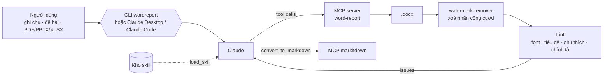

# ProjectWordByLLM – `wordreport`

Công cụ tự động soạn thảo và định dạng báo cáo Microsoft Word (.docx) bằng mô hình ngôn ngữ lớn (LLM).
Bạn đưa ghi chú, đề bài hoặc tài liệu nguồn; Claude viết nội dung và dựng báo cáo qua một **MCP server
dành riêng cho Word**. Một **kho skill** cho Claude biết quy tắc của từng tác vụ Word.

- Đầu ra: **đúng một file `.docx`** cho mỗi báo cáo (không xuất PDF, không tạo file phụ).
- Mọi file xuất ra được **watermark-remover** tự động xoá nhãn công cụ/AI trong metadata.

## Barem – mục đích chính của dự án

Mọi báo cáo đầu ra đều theo **một barem duy nhất**, lấy từ báo cáo mẫu *Báo cáo đồ án học phần Mạng máy tính –
CLC HCMUS* (xem [docs/phan-tich-bao-cao-mau.md](docs/phan-tich-bao-cao-mau.md)); bản dựng chuẩn là
`examples/output/mang-may-tinh-do-an.docx`. Đưa vào báo cáo trình bày kiểu gì (chương "CHƯƠNG 1:", đánh số
2.5.1, bìa khác, font khác…), công cụ chỉ lấy **nội dung** rồi dựng lại đúng khung và định dạng của barem:

| Phần | Nội dung | Định dạng |
|---|---|---|
| Bìa | Đại học, trường, loại báo cáo, học phần, đề tài, GVHD, thành viên, nơi – năm | Khung viền, chữ in hoa căn giữa |
| LỜI MỞ ĐẦU, MỤC LỤC | Trang riêng, kết thúc bằng `---o0o---` | Tiêu đề 20pt căn giữa, mục lục có dấu chấm dẫn |
| **I. Giới thiệu chung** | 1. Thành viên nhóm (bảng STT/MSSV/Họ và tên), 2. Bảng phân công công việc, rồi các mục giới thiệu thêm | Tự dựng từ dữ liệu |
| **II. Nội dung** | Các chương của báo cáo: `1.`, `1.1.`, `1.1.1.` | Tiêu đề xanh #2F5496 |
| **III. Tài liệu tham khảo** | Danh sách 1. 2. 3. | |
| Toàn bài | Times New Roman 14pt; header "Khoa … \| Mã lớp" có đường kẻ; số trang giữa chân trang; bảng có hàng tiêu đề xám, chú thích "Bảng N:" phía trên; "Hình N:" dưới hình; gạch đầu dòng "-" | |

`wordreport lint` và tool MCP `check_barem` chấm theo barem: thiếu lời mở đầu, thành viên, bảng phân công,
GVHD, chương nội dung, tài liệu tham khảo… đều được liệt kê. Câu dẫn tới bảng/hình/mục dùng tham chiếu chéo
`[[label]]` nên số luôn đúng sau khi đổi khung.

## Cách hoạt động



Claude chỉ lo nội dung và cấu trúc; toàn bộ định dạng (font, lề, đánh số tiêu đề, mục lục, chú thích,
header/footer) do renderer áp theo profile:

| Profile | Dùng cho |
|---|---|
| `hcmus-clc` (mặc định) | **Barem** ở trên |
| `nd30-a4` | Văn bản doanh nghiệp/hành chính A4 (lề 3-2-2-2 cm, TNR 13pt), không có mục thành viên/phân công |

Trong văn bản hỗ trợ `**đậm**`, `*nghiêng*`, `` `mã` ``, `[chữ](url)`, chỉ số dưới/trên `V~OUT~`, `x^2^` và
tham chiếu chéo `[[label]]`.

## Cài đặt

Yêu cầu Python ≥ 3.10. Trên Windows (PowerShell):

```powershell
git clone https://github.com/phuocs0n/ProjectWordByLLM.git
cd ProjectWordByLLM
python -m venv .venv
.venv\Scripts\Activate.ps1
pip install -e ".[dev,markitdown]"
pip install pywin32          # tuỳ chọn: để Word tự cập nhật số trang mục lục
pip install markitdown-mcp   # tuỳ chọn: MCP đọc PDF/PPTX/XLSX
$env:ANTHROPIC_API_KEY = "sk-ant-..."   # chỉ cần cho lệnh generate
```

Số trang của mục lục, danh mục hình/bảng do **Microsoft Word** tính: trên Windows có `pywin32`, công cụ điều
khiển Word cập nhật ngay; nếu không, khi mở file bằng Word hãy chọn **Yes** ở hộp thoại cập nhật field.
Công cụ không dùng LibreOffice.

## Sử dụng

### 1. Để Claude soạn báo cáo

```bash
wordreport generate "Soạn báo cáo đồ án học phần theo ghi chú, văn phong học thuật" \
    --notes examples/ghi-chu-bao-cao.md --source "C:\Users\me\Desktop\de-bai.pdf" \
    -o out/bao-cao.docx --markitdown
```

- Chế độ mặc định `agent`: Claude nạp skill, đổ nội dung vào barem qua MCP, chấm barem, lưu, đọc lint và tự sửa.
- Đưa một báo cáo có sẵn (`--source bao-cao-cu.pdf`) để định dạng lại: kết quả theo barem, không theo file nguồn.
- `--mode plan`: một lượt gọi, nhanh hơn, phù hợp khi ghi chú đã đủ ý.
- Tuỳ chọn: `--model` (mặc định `claude-opus-5`), `--effort low|medium|high|xhigh|max`, `--profile`.

### 2. Render lại từ file spec (không cần LLM)

```bash
wordreport render examples/mang-may-tinh-do-an.json -o out/bao-cao.docx
```

Dữ liệu đầu vào theo barem: `meta` (bìa, `members`), `preface`, `assignments`, `introduction` (mục giới thiệu
thêm), `body` (các chương, tiêu đề cấp 1), `references` – xem `examples/mang-may-tinh-do-an.json`.

### 3. Dùng trong Claude Desktop / Claude Code

- **Claude Code:** mở thư mục dự án – file `.mcp.json` đã khai báo `word-report`, `word` (MCP Microsoft Word)
  và `markitdown`.
  Chép kho skill: `wordreport skills install --dest .claude/skills` (hoặc `~/.claude/skills`).
- **Claude Desktop (Windows):** chép nội dung `examples/claude_desktop_config.windows.json` vào
  `%APPDATA%\Claude\claude_desktop_config.json`, sửa đường dẫn cho đúng máy, khởi động lại Claude Desktop.

### 4. Watermark-remover

Tự chạy ở bước cuối của mọi lệnh xuất file. Dùng riêng cho file .docx bất kỳ:

```bash
watermark-remover bao-cao.docx                          # ghi đè file
watermark-remover bao-cao.docx -o sach.docx --author "Nguyễn Văn A"
watermark-remover --check *.docx                        # chỉ liệt kê nhãn còn sót
```

Xoá: mô tả/ghi chú "Tạo bởi…", tác giả là tên thư viện/AI, ứng dụng/phiên bản/template/công ty,
ngày tạo cũ của template, ảnh thu nhỏ template, và các đoạn chỉ gồm nhãn kiểu "Generated with …" /
"Tạo bởi AI". Nội dung, bảng, hình, định dạng và dòng tác giả thật được giữ nguyên.
Tương đương: `wordreport clean …` hoặc tool MCP `remove_watermarks`.

### 5. Kiểm tra và đọc file Word có sẵn

```bash
wordreport lint "bao-cao-cu.docx"          # chấm barem + font, tiêu đề, chú thích, chính tả, nhãn AI...
wordreport inspect "bao-cao-cu.docx"       # xuất Markdown
```

## MCP Microsoft Word (`word`)

Dùng [Office-Word-MCP-Server](https://github.com/GongRzhe/Office-Word-MCP-Server) để sửa chi tiết file .docx
sau khi dựng (thay chữ, định dạng ô bảng, gộp ô, chú thích cuối trang, bình luận, bảo vệ tài liệu) và để
kiểm tra file (dàn ý, tìm chữ). Chạy bằng `uvx --from office-word-mcp-server word_mcp_server` (cần
[uv](https://docs.astral.sh/uv/)); agent của `wordreport generate` tự kết nối (tắt bằng `--no-word-mcp`, đổi
lệnh chạy bằng biến `WORDREPORT_WORD_MCP`). Quy tắc dùng nằm trong skill `word-mcp`.

## MCP server `word-report`

| Nhóm | Tool |
|---|---|
| Skill & profile | `list_skills`, `load_skill`, `list_profiles` |
| Soạn thảo | `create_report`, `set_meta`, `set_preface`, `set_assignments`, `add_blocks` (`section`: body / introduction), `add_heading`, `add_paragraph`, `add_list`, `add_table`, `add_image`, `add_figure_placeholder`, `add_code_block`, `add_note`, `add_reference` |
| Chỉnh sửa | `get_outline` (dàn ý thật sau khi áp barem), `get_spec`, `update_block`, `delete_block`, `move_block`, `load_spec` |
| Barem | `check_barem` |
| Xuất file | `save_report` (.docx + số trang mục lục + watermark-remover + lint), `render_spec_file` |
| Đọc & kiểm tra | `read_document`, `document_outline`, `lint_document`, `remove_watermarks` |

## Kho skill (`skills/`)

| Skill | Dùng khi |
|---|---|
| `report-structure-vn` | **Barem**: khung bắt buộc và cách đổ mọi báo cáo vào khung |
| `cover-page` | Trang bìa, header/footer |
| `heading-numbering` | Tiêu đề nhiều cấp, đánh số tự động |
| `table-of-contents` | Mục lục tự động và số trang |
| `tables` | Bảng thành viên, phân công, IP, số liệu |
| `figures-captions` | Ảnh, chú thích "Hình N", khung giữ chỗ ảnh chụp |
| `code-cli-blocks` | Lệnh Cisco/Linux/PowerShell, mã nguồn |
| `lists` | Chọn kiểu danh sách |
| `academic-writing-vn` | Văn phong, thuật ngữ, lỗi chính tả hay gặp |
| `references` | Tài liệu tham khảo |
| `quality-check` | Chấm barem, lint và vòng lặp sửa lỗi |
| `watermark-remover` | Xoá nhãn công cụ/AI khỏi file .docx |
| `word-mcp` | Sửa chi tiết file .docx bằng MCP Microsoft Word |
| `read-sources` | Đọc PDF/DOCX/PPTX/XLSX/URL qua markitdown (đổi `C:\...` → `file:///C:/...`) |
| `data-analysis-report` | Báo cáo phân tích dữ liệu Python: pandas → bảng, matplotlib → hình |
| `edit-existing-docx` | Chuẩn hoá lại một file Word có sẵn |

Thêm skill mới: tạo `skills/<ten-skill>/SKILL.md` với frontmatter `name` (trùng tên thư mục) và `description`
(nói rõ *khi nào dùng*).

## Giới hạn

- Không có Microsoft Word thì mục lục chưa có số trang cho tới khi mở file bằng Word và cập nhật field.
- Chưa hỗ trợ phụ lục đánh số riêng, bảng gộp ô, khổ ngang từng trang, công thức toán dạng equation (phân số
  viết một dòng).
- Logo trường không kèm theo repo; đặt `meta.logo_path` tới file logo của bạn.
