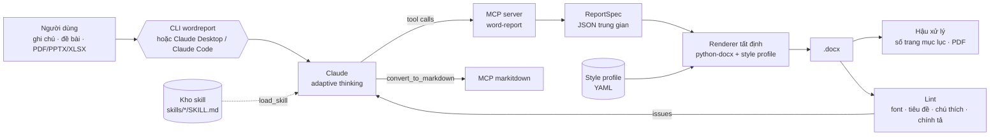

# ProjectWordByLLM – `wordreport`

Công cụ tự động soạn thảo và định dạng báo cáo Microsoft Word (.docx) bằng mô hình ngôn ngữ lớn (LLM).
Bạn đưa ghi chú, đề bài hoặc tài liệu nguồn; Claude viết nội dung và dựng báo cáo qua một **MCP server
dành riêng cho Word**. Một **kho skill** cho Claude biết quy tắc của từng tác vụ Word.

Quy chuẩn định dạng mặc định lấy từ báo cáo mẫu *Báo cáo đồ án học phần Mạng máy tính – CLC HCMUS*
(xem [docs/phan-tich-bao-cao-mau.md](docs/phan-tich-bao-cao-mau.md)).

## Kiến trúc



**Nguyên tắc:** LLM chỉ lo *nội dung và cấu trúc* (ReportSpec); mọi định dạng (font, lề, đánh số tiêu đề,
mục lục, chú thích, header/footer) do renderer làm theo style profile. Vì vậy báo cáo luôn đồng nhất, và
LLM không thể làm hỏng XML của Word.

| Thành phần | File | Vai trò |
|---|---|---|
| ReportSpec | `src/wordreport/spec.py` | Lược đồ Pydantic: `meta`, `preface`, `body` (10 loại block), `references` |
| Renderer | `src/wordreport/renderer/` | Dựng 3 section (bìa / phần đầu / nội dung), field TOC · PAGE · SEQ, danh sách đánh số thật |
| Style profile | `src/wordreport/profiles/*.yaml` | `hcmus-clc` (theo bản mẫu), `nd30-a4` (A4 doanh nghiệp, kế thừa bằng `extends`) |
| MCP server | `src/wordreport/mcp_server.py` | 28 tool Word cho LLM (stdio hoặc HTTP) |
| Kho skill | `skills/` | 14 skill định dạng Agent Skills (dùng được cả trong Claude Code/Desktop) |
| Agent | `src/wordreport/agent.py` | Claude + tool runner + MCP, nạp skill theo nhu cầu |
| Planner | `src/wordreport/planner.py` | 1 lượt gọi Claude, structured output → ReportSpec |
| Hậu xử lý | `src/wordreport/postprocess.py` | Điền số trang mục lục (Word COM hoặc LibreOffice), xuất PDF |
| Lint / đọc | `src/wordreport/inspector.py` | Kiểm tra chất lượng, chuyển .docx → Markdown |

## Cài đặt

Yêu cầu Python ≥ 3.10. Trên Windows (PowerShell):

```powershell
git clone https://github.com/phuocs0n/ProjectWordByLLM.git
cd ProjectWordByLLM
python -m venv .venv
.venv\Scripts\Activate.ps1
pip install -e ".[dev,markitdown]"
pip install pywin32          # tuỳ chọn: để Word tự cập nhật số trang mục lục
pip install markitdown-mcp   # tuỳ chọn: MCP đọc PDF/PPTX/XLSX
$env:ANTHROPIC_API_KEY = "sk-ant-..."   # chỉ cần cho lệnh generate
```

LibreOffice (tuỳ chọn) dùng để xuất PDF và điền số trang mục lục khi không có Microsoft Word.

## Sử dụng

### 1. Render từ ReportSpec (không cần LLM)

```bash
wordreport render examples/mang-may-tinh-do-an.json -o out/bao-cao.docx --pdf
wordreport render examples/mang-may-tinh-do-an.json -o out/bao-cao-a4.docx --profile nd30-a4
```

### 2. Để Claude soạn báo cáo (chế độ agent – mặc định)

```bash
wordreport generate "Soạn báo cáo đồ án học phần theo ghi chú, văn phong học thuật" \
    --notes examples/ghi-chu-bao-cao.md --source "C:\Users\me\Desktop\de-bai.pdf" \
    -o out/bao-cao.docx --markitdown --pdf
```

Claude gọi `load_skill('report-structure-vn')` → `create_report` → `add_blocks` theo từng chương →
`save_report` → đọc kết quả lint → tự sửa → lưu lại. Ngoài `.docx`, công cụ lưu `.spec.json` để chỉnh sửa về sau.

### 3. Chế độ plan (nhanh, 1 lượt gọi)

```bash
wordreport generate --notes examples/ghi-chu-bao-cao.md -o out/bao-cao.docx --mode plan
```

Tuỳ chọn chung: `--model` (mặc định `claude-opus-5`, hoặc biến `WORDREPORT_MODEL`), `--effort low|medium|high|xhigh|max`,
`--profile`. Các lời gọi dùng adaptive thinking và bật fallback phía server (`fallbacks: "default"`) để tự
chuyển model dự phòng nếu model chính từ chối yêu cầu.

### 4. Dùng trong Claude Desktop / Claude Code

- **Claude Code:** mở thư mục dự án – file `.mcp.json` đã khai báo `word-report` và `markitdown`.
  Chép kho skill vào Claude Code: `wordreport skills install --dest .claude/skills` (hoặc `~/.claude/skills`).
- **Claude Desktop (Windows):** chép nội dung `examples/claude_desktop_config.windows.json` vào
  `%APPDATA%\Claude\claude_desktop_config.json`, sửa đường dẫn cho đúng máy, khởi động lại Claude Desktop.
- Server HTTP: `wordreport mcp --http --port 8765` → `http://127.0.0.1:8765/mcp`.

### 5. Kiểm tra và đọc file Word có sẵn

```bash
wordreport lint "bao-cao-cu.docx"          # lỗi font, tiêu đề, chú thích, gạch đầu dòng gõ tay, chính tả...
wordreport inspect "bao-cao-cu.docx"       # xuất Markdown
wordreport inspect "bao-cao-cu.docx" --outline
```

## MCP server `word-report`

| Nhóm | Tool |
|---|---|
| Skill & profile | `list_skills`, `load_skill`, `list_profiles` (+ resource `skill://{name}`) |
| Soạn thảo | `create_report`, `set_meta`, `set_preface`, `add_blocks`, `add_heading`, `add_paragraph`, `add_list`, `add_table`, `add_image`, `add_figure_placeholder`, `add_code_block`, `add_note`, `add_reference` |
| Chỉnh sửa | `get_outline`, `get_spec`, `update_block`, `delete_block`, `move_block`, `load_spec` |
| Xuất bản | `save_report` (docx + spec.json + số trang mục lục + lint + PDF tuỳ chọn), `render_spec_file`, `export_to_pdf` |
| Đọc & kiểm tra | `read_document`, `document_outline`, `lint_document` |

Lỗi dữ liệu (block sai kiểu, chỉ số ngoài phạm vi…) được trả về cho model với thông điệp cụ thể để nó tự sửa.

Cần sửa nhỏ trực tiếp trên một file .docx lạ mà vẫn giữ nguyên bố cục gốc? Có thể dùng kèm một Word MCP
tổng quát của bên thứ ba (ví dụ dự án mã nguồn mở *Office-Word-MCP-Server*; kiểm tra tài liệu của dự án đó
trước khi cài), còn `word-report` dùng để dựng/chuẩn hoá báo cáo theo profile.

## Kho skill (`skills/`)

| Skill | Dùng khi |
|---|---|
| `report-structure-vn` | Bắt đầu một báo cáo: dàn ý chuẩn tiếng Việt, ánh xạ sang ReportSpec |
| `cover-page` | Trang bìa, header/footer |
| `heading-numbering` | Tiêu đề nhiều cấp, đánh số tự động |
| `table-of-contents` | Mục lục tự động và số trang |
| `tables` | Bảng thành viên, phân công, IP, số liệu |
| `figures-captions` | Ảnh, chú thích "Hình N", khung giữ chỗ ảnh chụp |
| `code-cli-blocks` | Lệnh Cisco/Linux/PowerShell, mã nguồn |
| `lists` | Chọn kiểu danh sách |
| `academic-writing-vn` | Văn phong, thuật ngữ, lỗi chính tả hay gặp |
| `references` | Tài liệu tham khảo |
| `quality-check` | Lint và vòng lặp sửa lỗi |
| `read-sources` | Đọc PDF/DOCX/PPTX/XLSX/URL qua markitdown (đổi `C:\...` → `file:///C:/...`) |
| `data-analysis-report` | Báo cáo phân tích dữ liệu Python: pandas → bảng, matplotlib → hình |
| `edit-existing-docx` | Chuẩn hoá lại một file Word có sẵn |

Thêm skill mới: tạo `skills/<ten-skill>/SKILL.md` với frontmatter `name` (trùng tên thư mục) và `description`
(nói rõ *khi nào dùng*). Agent tự thấy skill mới ở lần chạy sau; `tests/test_skills.py` kiểm tra định dạng
và việc skill chỉ nhắc tới tool có thật.

## ReportSpec – các loại block

| `type` | Trường chính |
|---|---|
| `heading` | `level` 1–3, `text` (không kèm số) |
| `paragraph` | `text`, `align` |
| `list` | `items`, `style` dash/bullet/number/roman/alpha, `level` |
| `table` | `columns`, `rows`, `caption`, `col_widths` |
| `image` | `path`, `caption`, `width_cm` |
| `figure_placeholder` | `caption`, `description` |
| `code` | `code`, `caption`, `language` |
| `note` | `text`, `kind` note/tip/warning |
| `page_break`, `divider` | – |

Văn bản hỗ trợ `**đậm**`, `*nghiêng*`, `` `mã` ``, `[chữ](url)`. Ví dụ đầy đủ: `examples/mang-may-tinh-do-an.json`.

## Tạo style profile riêng

```yaml
# my-company.yaml
name: my-company
extends: nd30-a4
headings: {color: "C00000"}
header: {left: "{faculty}", right: "Mật – {class_code}"}
table: {header_fill: "FCE4D6"}
```

`wordreport render spec.json --profile path/to/my-company.yaml`

## Kiểm thử

```bash
pytest -q
```

Bộ test gồm renderer, lint, định vị số trang mục lục, MCP server (in-process), kho skill, và chạy agent/planner
end-to-end với Claude API giả lập (không cần API key).

## Giới hạn

- Số trang mục lục chính xác tuyệt đối khi có Microsoft Word (COM); với LibreOffice là ước lượng theo bản PDF
  (font Liberation Serif cùng metric với Times New Roman). Word vẫn đề nghị cập nhật field khi mở file.
- Chưa hỗ trợ phụ lục đánh số riêng, danh mục hình/bảng, bảng gộp ô, khổ ngang từng trang.
- Logo trường không kèm theo repo; đặt `meta.logo_path` tới file logo của bạn.
